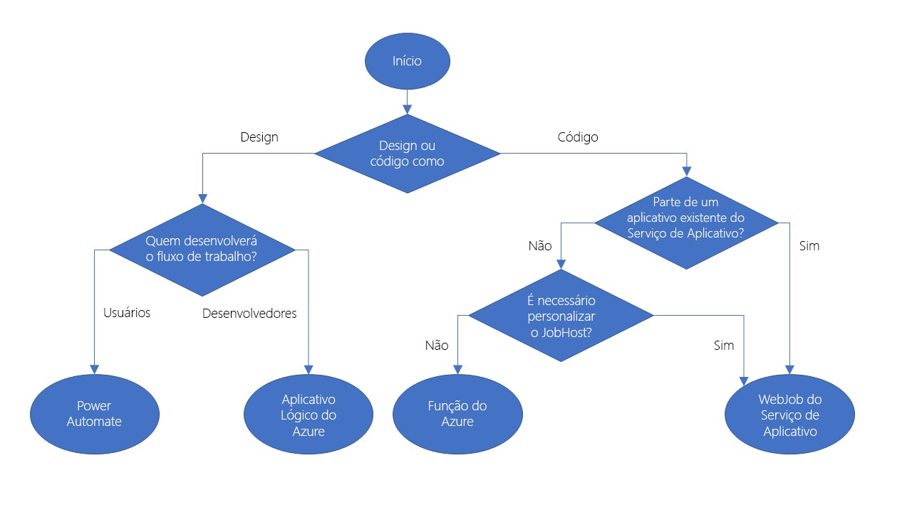

# Introdução
Esse texto é um resumo das minhas anotações feitas durante o estudo do [**Desafio de habilidades de nuvem Azure Developer**](https://docs.microsoft.com/pt-br/learn/challenges?id=4b2f91e9-04c5-4a1c-8f67-443adefd0806). Tive essa ideia após ler a thread da [Beatriz Oliveira](https://twitter.com/biantris_/status/1398426998054309890) sobre uma vaga na Entria. Nela, havia um link para a postagem [Aprenda em Público](https://daniloab.medium.com/aprenda-em-p%C3%BAblico-cf6c67ad5fc3) do [Danilo Assis](https://daniloab.medium.com/). 
Disclaimer: todas as anotações serão postadas "as is", ou seja, como foram feitas.

# Identificar as opções de tecnologia

Os processos empresariais modelados em software geralmente são chamados de fluxo de trabalho.

Há 4 tecnologias diferentes para criar e implementar fluxos de trabalho:

- Aplicativos lógicos;
- Microsoft Power Automate
- WebJobs
- Azure Functions

Elas têm algumas semelhanças:

- aceitam entradas: dado ou arquivo fornecido para o fluxo de trabalho;
- excutam ações: operação simples executada pelo fluxo de trabalho;
- podem incluir condições: teste para decidir a ação que será tomada em seguida;
- produzir saídas: dado ou arquivo criado pelo fluxo de trabalho.

## Tecnologias que têm o design como prioridade

Abordagem semelhante a desenhar um fluxo no papel.

### Aplicativos lógicos

- Serviço do Azure que pode ser usado para automatizar, orquestrar e integrar componentes diferentes de um aplicativo distribuído;
- é possível desenhar fluxos de trabalho complexos;
- caso prefira trabalhar no código, é possível criar ou editar um fluxo na notação JSON;
- há mais de 200 conectores incluídos — conectores são componentes que oferecem uma interface para serviços externos. Exemplo: twitter, outlook etc.
- é possível criar conectores para seu serviço caso o exponha como uma API REST.

## Microsoft Power Automate

Serviço que pode ser usado para criar fluxos de trabalho mesmo quando você não tem experiência em desenvolvimento.

Há 4 tipos de fluxos:

- automatizado: fluxo iniciado por um gatilho de algum evento — chegada de um novo tweet ou um novo arquivo que está sendo carregado;
- botão — use um fluxo de botão para executar uma tarefa repetitiva com um clique simples em seu dispositivo móvel;
- agendado — executado regularmente;
- processo empresarial: fluxo que modela um processo empresarial, como o processo de ordenação de estoque ou o procedimento de reclamações. O processo de fluxo pode ter: notificação para as pessoas necessárias; com a aprovação delas registrada; datas do calendário para etapas; e as etapas de tempo de fluxo registradas;

## Comparação entre Microsoft Power Automate e Aplicativos Lógicos 
| Propriedade                                  | Microsoft Power Automate                              | Aplicativos Lógicos                                                                                                       |
|----------------------------------------------|-------------------------------------------------------|---------------------------------------------------------------------------------------------------------------------------|
| Usuários pretendidos                         | Funcionários administrativos e analistas de negócios  | Desenvolvedores e profissionais de TI                                                                                     |
| Cenários pretendidos                         | Criação de fluxo de trabalho de autoatendimento       | Projetos de integração avançada                                                                                           |
| Ferramentas de design                        | Somente GUI\. Navegador e aplicativo móvel            | Navegador e designer do Visual Studio\. Possibilidade de edição de código                                                 |
| Gerenciamento do Ciclo de Vida do Aplicativo | O Power Automate inclui ambientes de teste e produção | O código\-fonte dos Aplicativos Lógicos pode ser incluído no Azure DevOps e em sistemas de gerenciamento de código\-fonte |

## Tecnologias que têm o código como prioridade

Usá-as vale a pena quando você deseja ter mais controle sobre o desempenho de seu fluxo de trabalho ou precisa escrever um código personalizado como parte de um processo empresarial.

### WebJobs e o SDK do WebJobs

O Serviço de aplicativo do azure é um serviço de hospedagem baseado em nuvem para aplicativos Web, back-ends móveis e APIs RESTful. Esses aplicativos precisam executar uma tarefa em segundo plano. 

WebJobs é uma parte do Serviço de Aplicativo do Azure que pode ser usada para executar um programa ou um script automaticamente. Há 2 tipos de WebJobs:

- Contínuos: executados em loop contínuo.
- Disparados: executados quando você os inicia manualmente ou de acordo com um agendamento.

Você pode escrever código em várias linguagens: 

- Script de Shell;
- PHP;
- Python;
- Node.js;
- JS

Esses WebJobs têm limitações, como suport apenas para [ASP.NET](http://asp.NET) / SDK 2.x. SDK 3.x dá suporte ao .NET Core.

Além disso, também pode programar usando .NET Framework ou o .NET Core e alguma linguagem .NET.

### Azure Functions

Modo simples de executar pequenos trechos de código na nuvem sem se preocupar com a infra necessária para hospedar esse código. Com a opção de plano de consumo, você só paga pelo tempo em que o código é executado. O Azure fimensiona automaticamente a função em resposta à demanda dos usuários.

Há vários modelos para criar uma Azure Function:

- HttpTrigger: quando desejar que o código seja executado em resposta a uma solicitação enviada por meio do protocolo HTTP;
- TimerTrigger: quando desejar que o código seja executado de acordo com um agendamento;
- BlobTrigger: quando desejar que o código seja executado quando um novo blob for adicionado a uma conta do Armazenamento do Azure;
- CosmosDBTrigger: use esse modelo quando desejar que o código seja executado em resposta a documentos novos ou atualizados em um bado de dados NoSQL;
- 

## Comparação de tecnologias que têm o código como prioridade
| Propriedade                                                | Azure WebJobs                                   | Azure Functions                         |
|------------------------------------------------------------|-------------------------------------------------|-----------------------------------------|
| Linguagens compatíveis                                     | C\# caso você esteja usando o SDK do WebJobs    | C\#, Java, JavaScript, PowerShell etc\. |
| Dimensionamento automático                                 | Não                                             | Sim                                     |
| Desenvolvimento e teste em um navegador                    | Não                                             | Sim                                     |
| Preço de pagamento por uso                                 | Não                                             | Sim                                     |
| Integração com os Aplicativos Lógicos                      | Não                                             | Sim                                     |
| Gerenciadores de pacotes                                   | NuGet, caso você esteja usando o SDK do WebJobs | NuGet e npm                             |
| Pode fazer parte de um aplicativo do Serviço de Aplicativo | Sim                                             | Não                                     |
| Fornece maior controle de JobHost                          | Sim                                             | Não                                     |

# Analisar os critérios de decisão

## Como escolher um serviço

## Como escolher uma tecnologia que tem o design como prioridade

A pergunta principal é quem criará o fluxo de trabalho: desenvolvedores ou usuários ? 

- Aplicativos lógicos possuem uma interface para desenvolvimento mas também há a possibilidade de editar o código-fonte de um fluxo de trabalho.
- No Power Automate, modelos e ajuda extra são fornecidos para tipos comuns de fluxo de trabalho. Não é possível editar o código-fonte — foi projetada para usuários que não possuem habilidade de codificação

## Como escolher uma tecnologia que tem o código como prioridade

Devido às várias funcionalidades, gatilhos, a capacidade de desenvolver código de teste no navegador e o modelo de preço de pagamento por uso, considere Azure Functions como padrão. Há duas situações em que o WebJobs pode ser uma melhor opção:

- você tem um Serviço de aplicativo do Azure e deseja modelar o fluxo de trabalho no aplicativo;
- você deseja fazer personalizações específicas no JobHost que não são compatíveis com o Azure Functions — exemplo: política de repetição personalizada para chamadas a serviços externos.
- WebJobs dá suporte apenas ao C# no Microsoft Windows.

## Como combinar tecnologias

Um dos motivos para combinar tecnologias nos processos é fornecer aos usuários o controle de uma pequena parte de um fluxo de trabalho completo. Faça isso com a implementação dessa seção no Microsoft Power Automate e, em seguida, chame esse fluxo em um aplicativo lógico, um WebJob ou uma função.

# Quando escolher o Azure Functions para executar sua lógica de negócios

Custo: com WebJobs, você paga pela VM inteira ou o Plano do Serviço de Aplicativo que hospeda o trabalho. O Azure Functions pode ser executado de acordo com um plano de consumo, portando, você paga apenas quando a função é executada;