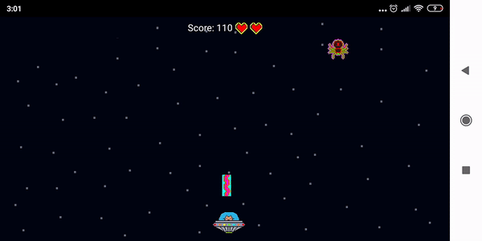
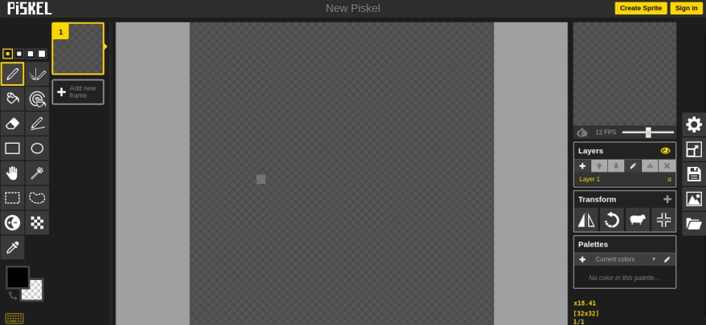
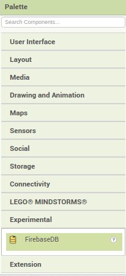
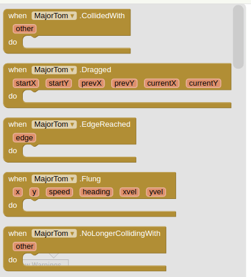
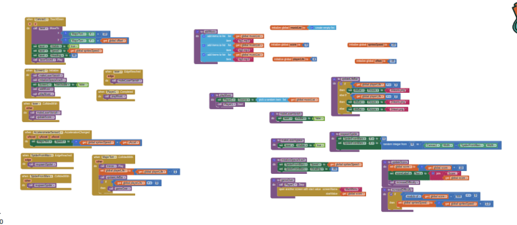

Reingressei na faculdade em 2020 e uma das matérias para o semestre chama-se "desenvolvimento de dispositivos móveis". Pensei que escreveria uns aplicativos em Kotlin ou Flutter, mas como a sala ainda não teve aulas de programação, fomos introduzidos ao [MIT App Inventor](http://ai2.appinventor.mit.edu/). De início, fiquei um pouco triste, mas decidi estudar a ferramenta para verificar o valor dela na introdução à programação.

## Sobre o app

Gosto de estudar ouvindo música. Assim que abri o aplicativo, cliquei numa playlist do David Bowie, então me surgiu a incrível ideia de criar um jogo no qual um gato chamado "Major Tom" (Space Oddity) enfrenta as "Spiders from Mars" (Ziggy Stardust). Viajei? Muito! Mas o resultado ficou bacana!

## Desenvolvimento

### Arte

O app foi feito em aproximadamente 4 horas. Delas, quase duas foram destinadas às artes e duas ao código. Toda a parte visual foi criada especificamente para esse game através do site [Piskel](https://www.piskelapp.com/p/create). Quanto aos sons, busquei por músicas do estilo "lo-fi" na [Audio Library do Youtube.](https://www.youtube.com/audiolibrary/music?nv=1)

*Interface do site Piskel.*

### Código

*De agora em diante, chamarei o App Inventor de AI*.

O AI possui vários componentes nos quais o usuário pode arrastar para a tela, bem semelhante ao "designer" do Android Studio. Eles vão desde componentes de interface, como botões e textos, até, pasmem, componentes de **integração com o firebase**

*Paleta de componentes do AI*

Cada um desses componentes possui blocos de código específicos, como eventos (cliques em botões e colisões em sprites) e alteração de propriedades do componente (troca de imagens, nome, label, altura, largura etc).

*Exemplos de blocos de código para o Major Tom*

Veja que os blocos possuem formas e encaixes. "Programar" no AI é como brincar de Lego: é só sair encaixando blocos.

Pensei em uma lógica simples para o app, pois não sabia até que ponto o AI limitaria a ideia:
* cada sprite possui lógica para movimentação e colisão;
* o movimento do player é feito através do acelerômetro do celular;
* a colisão entre os sprites é responsável pelo score e pela barra de vida do Major Tom;
* a colisão do laser e da aranha nas bordas do celular altera a visibilidade deles, tornando-os invisíveis;
* assim que a aranha colide com qualquer objeto, ela retorna ao ponto de "spawn" vertical, mas em uma posição horizontal aleatória;
* assim que a tela é tocada, a visibilidade do laser é alterada e a posição dele é resetada para a frente do player, dando a impressão de que se trata de um novo disparo;
* assim que a barra de vida é zerada, a tela de score é chamada passando o valor da variável "score". Existe um bloco que faz isso automaticamente.

Ao final, a única questão limitante foi o tamanho do app, que não pode passar de **10Mb**. O "código" final ficou da seguinte forma:

*Código completo*

### Dificuldades

Houve dois momentos nos quais senti algum tipo de dificuldade: o primeiro foi trabalhar com a lista de músicas que tocam ao fundo. Não sei se não prestei atenção pois implementei a feature às 3 da manhã, mas demorei a entender que só precisava digitar o nome da música dentro de um bloco para tocá-la. O segundo, que **não solucionei** (apesar de nem ter tentado o bastante), foi quando utilizei outro celular para testar e percebi que o app não era responsivo. Entretanto, uma lida a mais na [Documentação](http://appinventor.mit.edu/explore/library) teria resolvido o problema.

## Conclusão (?)

Por mais que estivesse cético quanto ao valor do AI no começo, achei o processo divertido e didático. Abstrair o conceito de objetos e atributos para "blocos" é genial (mas não inovador, pois há outras ferramentas que fazem isso, como o "GameMaker Studio"), tornando-o uma excelente forma de introdução à programação, mesmo para crianças (4 ou 5 anos com supervisão de um adulto).  

